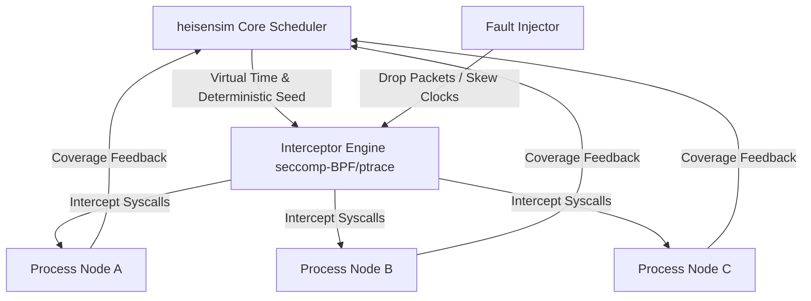

# heisensim

[](https://github.com/heisensim/heisensim/actions)
[](https://crates.io/crates/heisensim)
[](LICENSE-MIT)
[](#status)

> **"Find, reproduce, and fix the bugs you can't reproduce."**

**heisensim** (The Heisenbug Simulator) is a deterministic simulation testing platform for distributed systems, built in Rust. It captures non-deterministic process execution and turns complex distributed system concurrency bugs into 100% reproducible test cases.

---

## 🚧 Status

**Status: 🚧 Early Development**

heisensim is under active initial development. APIs and configurations are subject to rapid evolution. Contributions, design discussions, and early feedback are warmly welcome!

---

## ✨ Features

- **Deterministic Process Control**: Virtualizes non-deterministic syscalls (time, randomness, network I/O, thread scheduling) at the process level using **seccomp-BPF** and **ptrace**.
- **Fault Injection Engine**: Injects network partitions, process crashes, disk corruption, latency spikes, and clock skew deterministically.
- **100% Bug Reproducibility**: Every failure execution is tied to an explicit numeric seed. Rerunning `heisensim` with `--seed <SEED>` yields the exact same execution sequence down to the microsecond and instruction interleaving.
- **Coverage-Guided Exploration**: Uses coverage feedback (SanitizerCoverage/eBPF tracking) to autonomously search the state space for rare race conditions, deadlocks, and split-brain scenarios.
- **Unmodified Binaries**: Works directly with unmodified Linux container images (Docker / Docker Compose), requiring zero code modifications, dynamic linking overrides, or special SDKs.
- **CLI-First Workflow**: Designed for CI pipelines and developer terminal workflows with simple, expressive flags.

---

## 🚀 Quick Start

### Installation

Install via `cargo`:

```bash
cargo install heisensim
```

Or build from source:

```bash
git clone https://github.com/heisensim/heisensim.git
cd heisensim
cargo build --release
```

### Running Your First Simulation

Simulate a distributed cluster defined in a Docker Compose configuration:

```bash
heisensim run \
  --compose cluster.yml \
  --seed 42 \
  --faults partition,crash \
  --duration 30s
```

If `heisensim` discovers a safety invariant violation or assertion failure, it outputs a reproduction bundle:

```text
[!] INVARIANT VIOLATION DETECTED: Split-brain write accepted at t=14.285s
[+] Reproduction seed: 42
[+] Failure path saved to: ./heisensim-out/repro-42.json

To replay exact failure:
  heisensim replay ./heisensim-out/repro-42.json
```

---

## 🏗️ Architecture

`heisensim` is designed as a modular workspace consisting of focused Rust crates:

```text
heisensim/
├── crates/
│   ├── cli/        # Command-line interface, configuration parser & reporting
│   ├── core/       # Deterministic scheduler, virtual clock & event loop
│   ├── intercept/  # Low-level seccomp-BPF / ptrace syscall interception engine
│   ├── fault/      # Fault injectors (network partitions, clock skew, crashes)
│   └── props/      # Property checking & invariant specification engine
```

- **`heisensim-cli`**: Top-level user entry point handling CLI arguments, compose file parsing, and result output formatting.
- **`heisensim-core`**: The discrete-event simulation kernel responsible for seed management, virtual time step control, and scheduling state transitions.
- **`heisensim-intercept`**: Intercepts non-deterministic system calls (`clock_gettime`, `getrandom`, `epoll_wait`, `recvfrom`, `sched_yield`, etc.) using seccomp-BPF filter traps combined with `ptrace`.
- **`heisensim-fault`**: Programmable fault generator executing network partitions (packet drops/reordering), disk IO errors, node crashes/reboots, and clock drift.
- **`heisensim-props`**: Invariant checker evaluating temporal safety and liveness properties against the simulated cluster state.

---

## 💡 How It Works

Traditional chaos engineering (like Chaos Monkey) injects faults into live, non-deterministic environments. When a bug occurs, recreating the exact timing and interleaving is nearly impossible ("Heisenbugs").

`heisensim` takes a fundamentally different approach inspired by FoundationDB's deterministic simulation testing:



1. **Syscall Trapping**: Every process in the simulated cluster executes inside a restricted environment where non-deterministic syscalls (`clock_gettime`, `read`, `write`, `socket`, `getrandom`) trigger a BPF filter redirecting execution to `heisensim-intercept`.
2. **Virtual Clock & Network**: Real system time is replaced by a virtual simulation clock. Network packets pass through a synthetic software bridge controlled deterministically by the core scheduler.
3. **Deterministic Thread Scheduling**: Thread preemption and scheduler choices are converted into deterministic steps governed by a pseudo-random seed.
4. **Autonomous State Exploration**: Guided by code coverage feedback, `heisensim` continuously mutates scheduling choices and fault injection timings to probe unexplored execution branches.

---

## ⚖️ Comparison Matrix

| Feature | Jepsen | Chaos Monkey | Antithesis | **heisensim** |
| :--- | :---: | :---: | :---: | :---: |
| **Deterministic Simulation** | ❌ (Real time) | ❌ (Real time) | ✅ | ✅ |
| **100% Seed-Based Replay** | ❌ | ❌ | ✅ | ✅ |
| **Unmodified Linux Binaries** | ⚠️ (Requires Clojure harness) | ✅ | ✅ | ✅ |
| **Fault Injection** | ✅ | ✅ | ✅ | ✅ |
| **Execution Speed** | Real-time | Real-time | Faster than real-time | Faster than real-time |
| **Open Source** | ✅ (Clojure) | ✅ (Go) | ❌ (Proprietary SaaS) | ✅ (Rust / Apache 2.0 + MIT) |
| **Process-Level Interception** | ❌ | ❌ | Hypervisor (Custom VM) | `seccomp-BPF` / `ptrace` |

---

## 🛠️ Configuration Example

Define cluster faults and invariants in a `heisensim.toml` file:

```toml
[simulation]
seed = 42
max_steps = 100_000
virtual_time_ratio = 10.0

[[faults.partition]]
nodes = ["node1", "node2"]
duration_ms = 5000
probability = 0.3

[[faults.crash]]
target = "node3"
restart_delay_ms = 2000

[[invariants]]
name = "linearizability"
type = "read_write_register"
target = "kv_store"
```

---

## 📜 License

Licensed under either of:

- Apache License, Version 2.0 ([LICENSE-APACHE](LICENSE-APACHE) or <http://www.apache.org/licenses/LICENSE-2.0>)
- MIT License ([LICENSE-MIT](LICENSE-MIT) or <http://opensource.org/licenses/MIT>)

at your option.

---

## 🤝 Contributing

Unless you explicitly state otherwise, any contribution intentionally submitted for inclusion in the work by you, as defined in the Apache-2.0 license, shall be dual licensed as above, without any additional terms or conditions.
