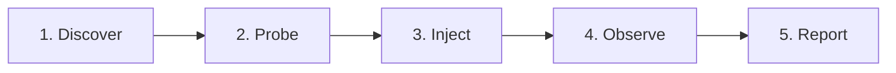

# heisensim

[](https://github.com/heisensim/heisensim/actions)
[](https://crates.io/crates/heisensim)
[](LICENSE-MIT)
[](#status)

> **"Deterministic chaos testing for Kubernetes"**

**heisensim** (The Heisenbug Simulator) is a deterministic chaos testing platform built in Rust for Kubernetes distributed systems. It automatically discovers your Kubernetes workloads, injects realistic network and pod faults, monitors pod health probes, and correlates failures with precise microsecond timing — enabling 100% reproducible chaos runs.

---

## 🧪 Status

**Status: 🧪 Alpha — Phase 1 Complete**

heisensim Phase 1 is complete! Core Kubernetes auto-discovery, probe monitoring, fault injection (pod crashes, latency, network partitions), event timeline correlation, and seed-based replay are fully functional.

---

## ✨ What It Does

- **Auto-discovers K8s pods and health probes**: Scrapes Kubernetes cluster APIs to discover target pods and their HTTP, TCP, and exec readiness/liveness probes.
- **Injects faults**: Simulates real-world infrastructure failures including pod crashes (`kubectl delete`), network latency (`tc netem`), and network partitions.
- **Monitors health probes during fault injection**: Continuously polls health probes during chaos runs to detect service degradation in real time.
- **Correlates faults to probe failures**: Maps injected faults to probe failures with microsecond-level timing precision and detailed event timelines.
- **Same seed = same faults = perfectly reproducible**: Uses pseudo-random seed generation (`--seed 42`). Running `heisensim` with the same seed produces identical fault sequences, timing, and target selection every time.

---

## 🚀 Quick Start

```bash
# Install
cargo install --git https://github.com/heisensim/heisensim
brew install k3d

# Create cluster and deploy demo app
k3d cluster create demo --wait
kubectl apply -f examples/k8s-demo/manifests.yaml
kubectl wait --for=condition=Ready pods --all -n heisensim-demo --timeout=60s

# Run chaos test
heisensim run --namespace heisensim-demo --seed 42 --duration 30s

# Replay exact same run
heisensim replay --seed 42 --namespace heisensim-demo --duration 30s
```

---

## 💻 CLI Reference

`heisensim` provides 4 primary subcommands:

### `heisensim run`
Runs a chaos simulation test against a Kubernetes namespace with specified fault injection rules and seed.

```bash
heisensim run [OPTIONS]
```

- `--namespace <NAMESPACE>`: Target Kubernetes namespace (default: `default`)
- `--duration <DURATION>`: Simulation duration e.g. `30s`, `5m` (default: `5m`)
- `--seed <SEED>`: Numeric seed for deterministic fault generation (default: random)
- `--config <PATH>`: Path to configuration file (e.g. `heisensim.toml`)
- `--workload <CMD>`: Optional workload command to execute during testing
- `--warmup <DURATION>`: Warmup delay before fault injection starts (default: `30s`)
- `--k3d`: Automatically spins up an ephemeral K3d cluster for the test run
- `--faults <LIST>`: Comma-separated fault types e.g. `crash,latency` (default: `crash,latency`)
- `--inject-method <METHOD>`: Network fault injection strategy: `exec` (container shell) or `debug` (ephemeral netshoot container) (default: `exec`)

### `heisensim replay`
Replays a previously executed simulation run using the exact same seed and parameters.

```bash
heisensim replay --seed <SEED> [OPTIONS]
```

- `--seed <SEED>`: (**Required**) Seed value of the run to reproduce
- `--namespace <NAMESPACE>`: Target Kubernetes namespace (default: `default`)
- `--duration <DURATION>`: Simulation replay duration (default: `5m`)
- `--config <PATH>`: Path to configuration file

### `heisensim init`
Auto-discovers running workloads and probes in a Kubernetes namespace and outputs a starter `heisensim.toml` configuration file.

```bash
heisensim init [OPTIONS]
```

- `--namespace <NAMESPACE>`: Target Kubernetes namespace (default: `default`)
- `--output <PATH>`: Output configuration file path (default: `heisensim.toml`)

### `heisensim report`
Generates formatted reports (terminal tables, markdown, or JSON) from recorded timeline event logs.

```bash
heisensim report --input <PATH> [OPTIONS]
```

- `--input <PATH>`: (**Required**) Path to recorded timeline JSON file
- `--format <FORMAT>`: Output format: `terminal`, `markdown`, or `json` (default: `terminal`)

---

## 🏗️ Architecture

`heisensim` is organized as a workspace of modular Rust crates:

```text
heisensim/
├── crates/
│   ├── cli/         # heisensim — CLI binary, argument parser & report generator
│   ├── timeline/    # heisensim-timeline — Microsecond event bus & timeline correlation
│   ├── probe/       # heisensim-probe — Async probe runners (HTTP, TCP, exec)
│   ├── k8s/         # heisensim-k8s — Kubernetes client, pod discovery & fault operators
│   ├── fault/       # heisensim-fault — Fault scheduling & pseudo-random generators
│   ├── core/        # heisensim-core — Core data models, event types & config schemas
│   ├── intercept/   # heisensim-intercept — (Future: Syscall interception engine)
│   └── props/       # heisensim-props — (Future: Invariant & property checking)
```

- **`heisensim`** (CLI): Top-level CLI binary handling command parsing, orchestration, and report formatting.
- **`heisensim-timeline`** (event bus): High-performance event bus recording microsecond-timestamped fault and probe events.
- **`heisensim-probe`** (health checks): Concurrent health check runner executing scraped HTTP, TCP, and exec probes.
- **`heisensim-k8s`** (K8s integration): Kubernetes API client for pod auto-discovery, container scraping, and fault execution.
- **`heisensim-fault`** (fault scheduling): Deterministic engine scheduling pod deletions, network delays (`tc netem`), and traffic drops.
- **`heisensim-core`** (shared types): Common domain models, simulation interfaces, and configuration types.
- **`heisensim-intercept`** *(Future)*: Low-level system call interception engine planned for Phase 3 process-level determinism.
- **`heisensim-props`** *(Future)*: Property checking engine planned for Phase 2 temporal logic verification.

---

## 💡 How It Works

`heisensim` executes chaos tests through a 5-stage pipeline:



1. **Discover**: Scrapes the Kubernetes API to discover active workloads, pod replicas, and health probe definitions (liveness, readiness, HTTP, TCP, exec).
2. **Probe**: Starts async health check runners to continuously monitor target pod endpoints at high frequency.
3. **Inject**: Applies pseudo-randomly scheduled faults (pod terminations, `tc` network delays, partitions) governed by the seed.
4. **Observe**: Captures probe failures and state transitions into `heisensim-timeline` with microsecond timestamps.
5. **Report**: Correlates injected faults directly with probe failures, rendering visual terminal summaries and emitting JSON timeline logs.

---

## ⚖️ Comparison Matrix

| Feature | heisensim | Chaos Monkey | Litmus | Chaos Mesh | Gremlin |
| :--- | :---: | :---: | :---: | :---: | :---: |
| **Deterministic Seed-Based Replay** | ✅ | ❌ | ❌ | ❌ | ❌ |
| **K8s Auto-Discovery & Probing** | ✅ | ❌ | ⚠️ (Manual CRDs) | ⚠️ (Manual CRDs) | ❌ |
| **Fault-to-Probe Latency Correlation** | ✅ | ❌ | ❌ | ❌ | ❌ |
| **Fault Injection (Pod Crash / Net)** | ✅ | ✅ (VM/AWS) | ✅ | ✅ | ✅ |
| **Zero-CRD CLI Workflow** | ✅ | ❌ | ❌ | ❌ | ❌ |
| **Open Source** | ✅ (Apache 2.0 / MIT) | ✅ (Apache 2.0) | ✅ (Apache 2.0) | ✅ (Apache 2.0) | ❌ (Proprietary) |

---

## 🗺️ Roadmap

- **Phase 1 ✅**: Kubernetes fault injection (crashes, latency, partitions), K8s pod/probe auto-discovery, microsecond timeline correlation engine, and deterministic seed-based execution.
- **Phase 2 🔜**: Autonomous state space explore mode, temporal property checking (`heisensim-props`), gRPC probe scraping, and custom workload assertions.
- **Phase 3 📋**: In-cluster DaemonSet agent, OpenTelemetry trace correlation, eBPF-based network partitions, and process-level syscall interception (`seccomp-BPF` / `ptrace`).

---

## 📜 License

Licensed under either of:

- Apache License, Version 2.0 ([LICENSE-APACHE](LICENSE-APACHE) or <http://www.apache.org/licenses/LICENSE-2.0>)
- MIT License ([LICENSE-MIT](LICENSE-MIT) or <http://opensource.org/licenses/MIT>)

at your option.

---

## 🤝 Contributing

Unless you explicitly state otherwise, any contribution intentionally submitted for inclusion in the work by you, as defined in the Apache-2.0 license, shall be dual licensed as above, without any additional terms or conditions.
